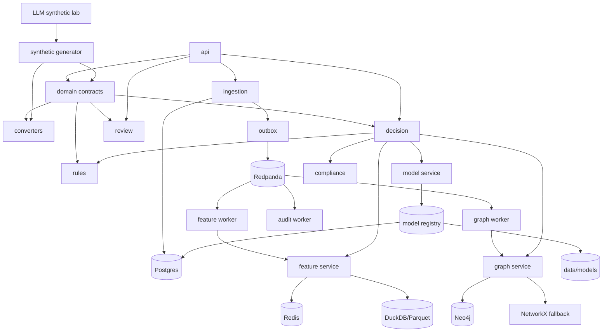

# Dependency Map

## Core Principle

Business contracts must not depend on infrastructure choices.

`domain` is allowed to know enums, schemas, and safe invariants. It must not
know FastAPI, Postgres, Redis, Redpanda, Neo4j, OpenAI, or Grafana.

## Layer Map



## Python Package Dependencies

| Area | Direct Dependencies | Must Not Import |
|---|---|---|
| `domain` | `pydantic`, standard library | FastAPI, SQLAlchemy, Redis, Neo4j, OpenAI |
| `config` | `pydantic-settings`, standard library | business services |
| `api` | `fastapi`, `uvicorn`, `domain`, services | model training internals |
| `ingestion` | `sqlalchemy/sqlmodel`, `psycopg`, `domain` | UI, model training |
| `streaming` | `quixstreams` or Kafka client, `domain` | FastAPI route objects |
| `features` | `redis`, `duckdb`, `pandas/polars`, `domain` | API framework |
| `graph` | `neo4j`, `networkx`, `domain` | UI framework |
| `rules` | `domain`, optional `pyyaml` | persistence |
| `models` | `scikit-learn`, `xgboost` or `lightgbm`, `joblib`, `numpy`, `pandas/polars` | FastAPI routes |
| `decision` | `domain`, `rules`, `features`, `graph`, `models`, `resilience` | raw connectors |
| `review` | `domain`, persistence | model training write paths except label events |
| `compliance` | `domain`, templates | real filing APIs |
| `llm_lab` | `openai` SDK or Azure-compatible client, `jsonschema`, `domain` | decision engine active scoring |
| `observability` | `opentelemetry`, `prometheus-client`, logging | business policy |

## Runtime Services

| Service | Required In Lite | Required In Full | Why |
|---|---:|---:|---|
| FastAPI | yes | yes | API and OpenAPI contract. |
| Postgres | optional | yes | Durable events, decisions, review, outbox. |
| SQLite | yes | no | Lite fallback for early contract tests. |
| Redis | optional | yes | Online feature lookup and circuit state. |
| DuckDB/Parquet | yes | yes | Offline features and replay. |
| Redpanda | no | yes | Event bus and stream replay. |
| Neo4j | no | yes | Graph query and analyst graph explanation. |
| NetworkX | yes | yes | Deterministic tests and lite graph fallback. |
| Prometheus | no | yes | Metrics. |
| Grafana | no | yes | Dashboards. |
| Loki | no | yes | Local log search. |
| OTel Collector | no | yes | Trace/metrics/log routing. |

## Run Profiles

### Lite Profile

Purpose:

- fastest local development
- domain tests
- synthetic data generation
- API contract tests
- rules and decision golden cases

Services:

- API
- SQLite or Postgres
- DuckDB/Parquet
- NetworkX

Skipped:

- Redpanda
- Neo4j
- Grafana
- Loki
- OTel Collector

### Full Profile

Purpose:

- production-shaped local demo
- streams
- graph
- observability
- resilience tests

Services:

- API
- Postgres
- Redis
- Redpanda
- Neo4j
- Prometheus
- Grafana
- Loki
- OTel Collector

### ML Profile

Purpose:

- train and evaluate models
- tune thresholds
- run drift/calibration reports
- generate synthetic data

Services:

- DuckDB/Parquet
- local model registry
- optional Postgres
- optional GPU

Skipped:

- GPU is never required.
- Graph deep learning is optional.

## Dependency Direction Rules

Allowed:

- `api` calls services.
- services use repositories.
- repositories use infrastructure clients.
- converters produce domain contracts.
- model training reads offline stores.
- decision service reads model artifacts through model service.

Forbidden:

- `domain` imports infrastructure.
- route handlers contain fraud policy.
- model training writes live decisions.
- LLM generation writes directly to training data without validation.
- compliance exporter files real SARs.
- feature code calls external vendors.

## Failure Dependency Map

| Dependency Fails | System Response |
|---|---|
| Postgres | API not ready; do not accept events or decisions. |
| Redpanda | API can accept events into outbox; worker lag and publish retry increase. |
| Redis | Decision uses Postgres/DuckDB fallback only for non-real-time routes; live scoring degrades to yellow if critical features missing. |
| Neo4j | Decision uses cached graph features if fresh; otherwise yellow/manual review. |
| Model artifact missing | Rules-only degraded mode; no active model score. |
| Model service error | Circuit breaker opens; rules-only degraded mode. |
| OpenAI/Azure unavailable | Synthetic data jobs pause; production scoring unaffected. |
| Grafana/Loki/OTel down | App still runs; readiness warns observability degraded. |

## Implementation Order Dependencies

| Build Item | Depends On | Blocks |
|---|---|---|
| Domain enums/classes | none | everything |
| Synthetic generator | domain | data, tests, demo |
| Converters | domain | ingestion, graph, features |
| Event store | domain, DB models | outbox, replay |
| Outbox | event store | Redpanda publishing |
| Feature registry | domain | decision engine, training |
| Rules engine | domain, features | decision engine |
| Decision engine | domain, rules, features | review, compliance |
| Dataset builder | domain, events, features | ML training |
| Baseline model | dataset builder | model service |
| Graph service | graph edges | graph features, graph UI |
| Review queue | decisions | label loop |
| Compliance drafts | decision traces | safe exports |
| Observability | service boundaries | production readiness |

## Local Package Policy

Use dependency groups:

```text
default: api, domain, config
dev: pytest, ruff, mypy, test tools
infra: postgres, redis, kafka/redpanda, neo4j clients
ml: scikit-learn, xgboost/lightgbm, pandas/polars, duckdb
graph-ml: torch, pytorch-geometric
llm: openai, jsonschema
ui: nicegui, pyvis or vis-network wrapper
observability: opentelemetry, prometheus-client
```

`graph-ml` must stay optional because the RTX 3050 has 4GB VRAM.

