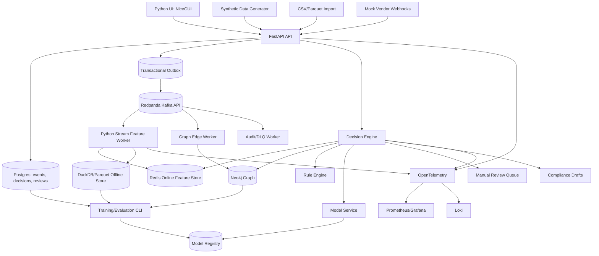

# Spec Plan: Fraud V2

## Current Note

This is the original broad target specification. It is preserved for product
and architecture context.

For the current runnable implementation, use:

- [README](../README.md)
- [Setup](setup.md)
- [Production Readiness](production-readiness.md)
- [Dependency Map](dependency-map.md)

Some original target choices in this file, such as NiceGUI, Loki, and an OTel
Collector, were superseded by the current local implementation: FastAPI HTML
dashboards, structured logs, trace IDs, optional JSONL trace reports,
Prometheus, and Grafana.

## One-Line Goal

Build a local-first, production-shaped fraud decision platform that ingests
identity, device, behavior, transaction, and graph events; computes fresh
features; scores fraud risk with rules, ML, and graph intelligence; explains
decisions; routes uncertainty to analysts; and measures reliability, drift, and
financial impact.

## Companion Specs

The main spec is supported by narrower planning docs:

| Document | Purpose |
|---|---|
| `plan-index.md` | Reading order, decisions made now, and implementation sequence. |
| `vagueness-register.md` | Open ambiguity, local V1 defaults, and production blockers. |
| `solution-tradeoffs.md` | Options and tradeoffs for stack, data, graph, ML, LLM, UI, and observability. |
| `dependency-map.md` | Runtime, package, service, and implementation dependencies. |
| `data-strategy.md` | Data acquisition, public datasets, synthetic generation, and quality gates. |
| `llm-synthetic-data-lab.md` | GPT-5.5/Azure/OpenAI synthetic data and edge-case generation plan. |
| `local-production-profile.md` | Laptop-safe production profile and resource budgets. |

## Target Product

The linked BryansLab article describes a full modern fraud stack:

- Layer 1: KYC/KYB, device/camera metadata, synthetic identity surveillance,
  consortium signals.
- Layer 2: real-time orchestration, Kappa architecture, feature freshness, and
  online/offline parity.
- Layer 3: graph risk, behavioral entropy, GNN-style message passing, and
  analyst graph explanation.
- Layer 4: actions, manual review, adverse action reasons, SAR workflows, and
  circuit breakers.
- Layer 5: MLOps feedback loops, calibration, analyst consistency, and drift.

This repo should turn that article into runnable software on Bryan's laptop
first. Production deployment comes later.

## Local Hardware Target

Observed local machine:

| Resource | Value | Design Impact |
|---|---|---|
| CPU | AMD Ryzen 7 5800H, 8 cores, 16 logical processors | Run API, workers, local databases, and model training with CPU fallback. |
| GPU | NVIDIA GeForce RTX 3050 Laptop GPU | Optional GPU experiments only. Do not require GPU for serving. |
| VRAM | 4096 MiB | Small PyTorch/PyG batches only. Prefer LightGBM or scikit-learn for baseline models. |
| Driver/CUDA | NVIDIA driver 565.90, CUDA 12.7 | Use optional CUDA extra after CPU path is working. |
| Python | 3.12.9 | Use Python 3.12 project baseline. |
| Package tool | uv 0.7.3 | Use `uv` for local dependency management. |
| Containers | Docker 28.4.0 | Run databases, event bus, and observability in Docker Compose. |

## What Is Not Vague

Hard requirements from Bryan's prompt:

| ID | Requirement | Acceptance Proof |
|---|---|---|
| NVR-001 | Python-first implementation. | `pyproject.toml` and service code use Python as the core runtime. |
| NVR-002 | Must run locally on Windows laptop. | `docker compose up` plus `uv run` commands start the stack locally. |
| NVR-003 | Build the whole fraud system, not a toy classifier. | Spec covers ingestion, features, rules, ML, graph, review, compliance, MLOps, observability, and resilience. |
| NVR-004 | Typed data definitions, enums, classes, inputs, outputs, converters. | `src/fraud_v2/domain/` and `src/fraud_v2/converters/` exist with tests. |
| NVR-005 | Modular and future-flexible. | Each component owns one responsibility and communicates through versioned contracts. |
| NVR-006 | Production-like reliability. | Health checks, circuit breakers, idempotency, DLQs, retries, audit logs, metrics, and traces exist. |
| NVR-007 | Explainable decisions. | Every decision response includes reason codes, rule hits, model version, feature freshness, and a safe reasoning trace. |
| NVR-008 | Custom financial reward function beats vanity metrics. | Evaluation reports include profit, Recall at 1 percent FPR, AUPRC, Brier score, PSI, and false positive cost. |

## What Is Vague

These must be answered before a live production build. For a local prototype,
the assumptions below are acceptable but must stay visible.

| Question | Why It Matters | Default For Local V1 |
|---|---|---|
| Is this for banking, lending, ecommerce, crypto, payroll, or a demo? | Fraud typologies, regulations, data model, and action authority change by domain. | Instant-cash / fintech style simulation. |
| Is the system allowed to auto-block real users? | Legal, brand, and safety risk. | No. Local V1 can simulate block actions only. |
| Is this an adverse credit decision system? | CFPB/ECOA adverse action requirements may apply. | Treat as credit-adjacent and log specific safe reasons. |
| Will real PII or SSNs be used? | Security, compliance, retention, and local disk risk. | No real PII. Synthetic data only. |
| Which labels exist? | ML quality depends on verified fraud, chargebacks, SAR outcomes, analyst labels, and delayed repayment/default labels. | Synthetic labels plus manual review labels. |
| What latency is required? | Architecture differs for sub-100ms scoring vs batch triage. | Local V1 target: p95 decision under 500ms without external vendors. |
| What throughput is required? | Redpanda, Flink, Redis, Postgres sizing depend on event volume. | Local V1 target: 50 events/sec sustained synthetic replay. |
| Which data vendors are approved? | KYC, device intelligence, consortium, liveness, and sanctions APIs require contracts and costs. | Mock adapters only. |
| Who are the users? | UI and permissions differ for analyst, investigator, compliance, and admin. | Analyst and admin roles. |
| What is the production target? | Windows laptop, Docker host, cloud Kubernetes, or bare metal changes ops. | Local Docker Compose only. |

Assumptions to keep explicit:

- assuming this is a local build and portfolio/research system, so I have to
  find out - I should not assume it will make real adverse decisions.
- assuming real KYC, SAR, banking, credit bureau, sanctions, and consortium
  integrations are out of scope for local V1, so I have to find out - I should
  not assume vendor access or legal approval.
- assuming "fully" means an end-to-end local product with synthetic data,
  mock connectors, typed contracts, observability, and a path to production,
  so I have to find out - I should not assume cloud deployment is required now.

## User Requirements

| ID | User | Need | Acceptance Proof |
|---|---|---|---|
| UR-001 | Fraud analyst | Review risky applications and transactions with clear reasons and graph evidence. | Analyst opens local UI, filters queue, views graph, records review decision. |
| UR-002 | Risk engineer | Add rules, features, and model versions without rewriting the system. | New rule, feature, and model adapter can be added with tests and no API contract break. |
| UR-003 | Founder/operator | Run the whole stack locally on Windows with one documented workflow. | `docs/setup.md` commands start API, UI, workers, and infra. |
| UR-004 | ML engineer | Train, calibrate, evaluate, and shadow a model against replayed events. | Evaluation report includes Recall at 1 percent FPR, AUPRC, Brier, PSI, and profit. |
| UR-005 | Compliance reviewer | See why an action happened without exposing unsafe internals or saying "risk score only." | Decision trace includes safe adverse-action style reasons and immutable audit log. |
| UR-006 | SRE/operator | Know when scoring is stale, degraded, or broken. | Grafana dashboard shows service health, latency, queue lag, feature freshness, DLQ count, and model health. |

## Functional Requirements

| ID | Requirement | Priority | Acceptance Proof |
|---|---|---|---|
| FR-001 | Ingest versioned events from API, CSV, and synthetic generator. | must | Events land in Postgres, Redpanda, and audit log with idempotency keys. |
| FR-002 | Normalize raw inputs into canonical domain contracts. | must | Converter tests cover valid, missing, malformed, and duplicate input. |
| FR-003 | Compute velocity, behavioral, device, KYC, and graph features. | must | Feature lookup returns values, freshness timestamps, and source event IDs. |
| FR-004 | Score decisions through a hybrid rules + ML + graph decision engine. | must | Decision endpoint returns tier, action, score, rule hits, model scores, and trace. |
| FR-005 | Provide circuit-breaker fallbacks. | must | Tests simulate model outage, graph outage, and stale features. |
| FR-006 | Create a manual review queue for yellow-band cases. | must | Yellow decisions create review cases and analyst decisions become labels. |
| FR-007 | Show graph explanation for entity neighborhoods and fraud rings. | must | UI displays linked user/device/IP/address/payment nodes and relationship reasons. |
| FR-008 | Train a baseline model on synthetic and replayed local data. | must | `uv run python -m fraud_v2.models.train` writes model artifact and metrics. |
| FR-009 | Evaluate cost-weighted model performance. | must | Evaluation report calculates profit function and threshold candidates. |
| FR-010 | Monitor data drift, score drift, calibration, and analyst consistency. | should | Metrics and reports include PSI, Brier score, and Cohen's kappa. |
| FR-011 | Export compliance-safe decision summaries and SAR drafts. | should | SAR/adverse-action exports are drafts requiring human review. |
| FR-012 | Support mock vendor adapters for KYC, device intel, liveness, and consortium data. | should | Mock adapters can be swapped behind connector interfaces. |
| FR-013 | Support shadow deployment of candidate models. | should | Candidate model scores are logged without changing primary action. |
| FR-014 | Support event replay from local Parquet/DuckDB. | should | Replay command rebuilds features and decisions deterministically. |

## Non-Goals

- Do not file real SARs.
- Do not connect to real KYC, sanctions, banking, card network, credit bureau,
  or consortium providers in local V1.
- Do not use real SSNs, bank accounts, passports, driver's licenses, or
  customer PII.
- Do not claim legal compliance without counsel review.
- Do not require GPU for local serving.
- Do not optimize for blockchain-specific Sybil detection in V1, though the
  graph layer should be flexible enough to add it later.

## Architecture



## Architecture Decisions

| Decision | Pick | Reason |
|---|---|---|
| Core language | Python 3.12 | Matches Bryan's preference and local environment. |
| API | FastAPI + Pydantic v2 | Typed contracts, OpenAPI docs, async support, strong local developer loop. |
| Data models | Pydantic for API/events, SQLAlchemy/SQLModel for persistence | Keeps boundary validation separate from database tables. |
| Event bus | Redpanda in Docker | Kafka-compatible local stream without operating a full Kafka/ZooKeeper setup. |
| Stream workers | Quix Streams or Bytewax for local V1; Flink later if needed | Python-first local development while preserving stream-processing boundaries. |
| Online store | Redis | Fast feature lookup and circuit state. |
| Durable store | Postgres | Events, decisions, review cases, model registry, audit metadata. |
| Offline store | DuckDB + Parquet | Local point-in-time feature snapshots without a warehouse. |
| Graph | Neo4j Community plus NetworkX fallback | Neo4j for graph queries/UI; NetworkX for tests and CPU-only fallback. |
| Baseline ML | LightGBM/scikit-learn | Strong tabular fraud baseline on CPU. |
| Graph ML | PyTorch Geometric optional extra | Use only after graph rules and baseline model work. |
| UI | NiceGUI + PyVis/vis-network | Python-first UI with interactive graph views. |
| Observability | OpenTelemetry, Prometheus, Grafana, Loki | Production-shaped metrics, traces, and logs locally. |
| Config | Pydantic Settings | Typed environment variables and local `.env`. |

## Components

| Component | Responsibility | Owns | Must Not Own |
|---|---|---|---|
| `api` | HTTP endpoints, auth boundary, request validation, response shape. | FastAPI routes, dependency injection, OpenAPI. | Business rules hidden inside routes. |
| `domain` | Versioned Pydantic contracts, enums, domain errors. | Input/output schemas and invariants. | Vendor-specific payload shapes. |
| `connectors` | External/mock system adapters. | KYC, device intel, consortium, payment, SAR draft adapters. | Canonical fraud decisions. |
| `converters` | Convert raw payloads into canonical events/features/edges. | Mapping rules and validation failures. | Persistence, scoring, UI. |
| `ingestion` | Idempotent event intake and transactional outbox. | Event storage, dedupe, publishing. | Feature logic. |
| `features` | Feature definitions, freshness, materialization, lookup. | Velocity, behavioral, device, KYC, and graph features. | Model decision policy. |
| `graph` | Entity resolution, edges, graph queries, community detection. | Nodes, relationships, graph scores, neighborhoods. | Final approval/block action. |
| `rules` | Deterministic fraud rules and reason codes. | YAML/Python rule definitions, rule hits. | Model training. |
| `models` | Training, inference, calibration, model registry. | Model artifacts, scores, explanations, shadow mode. | Legal reason generation. |
| `decision` | Combine rules, model, graph, and freshness into an action. | Risk tier, action, reasoning trace, threshold policy. | Raw vendor parsing. |
| `review` | Analyst queue and label capture. | Cases, notes, outcomes, inter-rater reliability data. | Automated model claims without labels. |
| `compliance` | Safe summaries, adverse-action style reasons, SAR drafts. | Reason sanitization, draft export, audit references. | Real legal filing. |
| `observability` | Metrics, traces, logs, health checks. | Instrumentation and dashboards. | Business decisions. |
| `resilience` | Circuit breakers, retry policy, DLQ, replay. | Failure handling patterns. | Domain feature definitions. |
| `ui` | Analyst and operator screens. | Queue, decision details, graph view, metrics links. | Hidden business logic. |

## Connectors

| Connector | System | Direction | Auth | Inputs | Outputs | Failure Handling |
|---|---|---|---|---|---|---|
| `KycVendorAdapter` | Mock KYC/KYB provider | inbound/outbound | local token | applicant/business payload | `KycResultEvent` | timeout -> yellow/manual review; malformed -> DLQ |
| `DeviceIntelAdapter` | Mock device intelligence | inbound/outbound | local token | session/device payload | `DeviceObservedEvent` | stale result -> mark feature stale |
| `ExifMetadataAdapter` | Local ExifTool or Python metadata parser | inbound | none/local file | image metadata | `CameraMetadata` | parser error -> `metadata_parse_failed` signal |
| `ConsortiumRiskAdapter` | Mock consortium blacklist | outbound | local token | device/email/phone/payment hashes | `ConsortiumHitEvent` | unavailable -> do not approve solely on missing data |
| `PaymentRailAdapter` | Mock payment/instant-cash rail | outbound | local token | payment attempt | `PaymentAttemptEvent` | idempotent retry, outbox, DLQ |
| `NotificationAdapter` | Mock SMS/email/push | outbound | local token | intervention request | `ActionTakenEvent` | retry with backoff; no silent drop |
| `SarDraftExporter` | Local compliance draft writer | outbound | local file | decision trace and entities | SAR draft file | never auto-file; human review required |
| `AdverseActionExporter` | Local safe reason writer | outbound | local file | decision trace | reason summary | if no safe reason, stop and manual review |

## Domain Enums

| Enum | Values | Meaning | Default |
|---|---|---|---|
| `EventType` | `APPLICATION_SUBMITTED`, `KYC_RESULT`, `DEVICE_OBSERVED`, `CAMERA_METADATA_OBSERVED`, `LOGIN_ATTEMPT`, `BEHAVIORAL_SIGNAL_OBSERVED`, `TRANSACTION_AUTHORIZED`, `PAYMENT_ATTEMPTED`, `PAYMENT_SETTLED`, `CHARGEBACK_RECEIVED`, `CONSORTIUM_HIT`, `MODEL_SCORE_CREATED`, `DECISION_CREATED`, `ACTION_TAKEN`, `MANUAL_REVIEW_DECIDED`, `LABEL_CREATED` | Canonical event stream type. | none |
| `EntityType` | `USER`, `PERSON`, `BUSINESS`, `DEVICE`, `IP_ADDRESS`, `EMAIL`, `PHONE`, `ADDRESS`, `CARD`, `BANK_ACCOUNT`, `DOCUMENT`, `SESSION`, `TRANSACTION`, `APPLICATION` | Graph node type. | none |
| `FraudTypology` | `SYNTHETIC_IDENTITY`, `ACCOUNT_TAKEOVER`, `CARD_TESTING`, `FIRST_PARTY_FRAUD`, `MONEY_MULE`, `APP_SCAM`, `BEC`, `DEEPFAKE_LIVENESS`, `REFUND_ABUSE`, `BUST_OUT`, `UNKNOWN` | Fraud pattern assigned by rules, model, or analyst. | `UNKNOWN` |
| `RiskTier` | `GREEN`, `YELLOW`, `RED` | Decision band. | `YELLOW` |
| `DecisionAction` | `APPROVE`, `STEP_UP_AUTH`, `MANUAL_REVIEW`, `BLOCK`, `HOLD_FUNDS`, `BREAK_THE_SPELL`, `SAR_DRAFT`, `NO_ACTION` | Action requested by the decision engine. | `MANUAL_REVIEW` |
| `ReviewOutcome` | `CONFIRMED_FRAUD`, `CONFIRMED_LEGITIMATE`, `NEEDS_MORE_INFO`, `ESCALATED`, `DUPLICATE`, `UNREVIEWABLE` | Analyst label/outcome. | none |
| `ModelFamily` | `RULES`, `GBDT`, `LOGISTIC_REGRESSION`, `GNN`, `ENSEMBLE`, `CALIBRATOR` | Model artifact family. | none |
| `FeatureFreshnessStatus` | `FRESH`, `STALE`, `MISSING`, `DEGRADED` | Feature lookup state. | `MISSING` |
| `DataClassification` | `PUBLIC`, `INTERNAL`, `SENSITIVE`, `RESTRICTED` | Data handling class. | `INTERNAL` |
| `ConnectorStatus` | `OK`, `TIMEOUT`, `UNAVAILABLE`, `MALFORMED`, `UNAUTHORIZED`, `RATE_LIMITED` | Connector result status. | none |
| `PolicyMode` | `ACTIVE`, `SHADOW`, `DISABLED` | Whether a rule/model can affect decisions. | `SHADOW` for new models |

## Data Definitions

| Object | Field | Type | Required | Source | Notes |
|---|---|---|---|---|---|
| `EventEnvelope` | `event_id` | UUID | yes | ingestion | Globally unique event ID. |
| `EventEnvelope` | `event_type` | `EventType` | yes | ingestion | Versioned canonical type. |
| `EventEnvelope` | `occurred_at` | datetime | yes | source | Business event time. |
| `EventEnvelope` | `received_at` | datetime | yes | API | System receive time. |
| `EventEnvelope` | `schema_version` | string | yes | domain | Enables event contract migration. |
| `EventEnvelope` | `idempotency_key` | string | yes | source/API | Required for retries. |
| `EventEnvelope` | `entity_refs` | list[`EntityRef`] | yes | converter | Links event to graph entities. |
| `EventEnvelope` | `payload` | typed payload | yes | converter | Discriminated by `event_type`. |
| `Applicant` | `applicant_id` | UUID | yes | application | Internal stable ID. |
| `Applicant` | `person_hash` | string | no | converter | Hash real PII; no raw SSN in V1. |
| `Applicant` | `declared_income` | decimal | no | application | Used for income anomaly and Benford tests. |
| `Applicant` | `date_of_birth_year` | int | no | application | Use partial synthetic data locally. |
| `Business` | `business_id` | UUID | yes | application | KYB entity. |
| `DeviceFingerprint` | `device_id` | string | yes | client/device adapter | Hash or provider-generated ID. |
| `DeviceFingerprint` | `browser_fingerprint_hash` | string | no | client/device adapter | High-risk shared identifier. |
| `DeviceFingerprint` | `user_agent` | string | no | client | Treat as untrusted. |
| `DeviceFingerprint` | `timezone_offset_minutes` | int | no | client | Useful for mismatch features. |
| `CameraMetadata` | `camera_make` | string | no | EXIF | Missing value can be a signal, not proof. |
| `CameraMetadata` | `camera_model` | string | no | EXIF | Null model raises risk signal. |
| `CameraMetadata` | `software_tag` | string | no | EXIF | Snap Camera/virtual camera signals. |
| `BehavioralSignal` | `keystroke_interval_ms_stddev` | float | no | frontend/session | Low entropy may indicate automation. |
| `BehavioralSignal` | `touch_pressure_entropy` | float | no | mobile/session | Optional future mobile signal. |
| `KycResult` | `vendor_status` | string | yes | KYC adapter | Raw vendor status preserved in restricted log. |
| `KycResult` | `normalized_status` | string | yes | converter | Canonical pass/fail/review. |
| `Transaction` | `transaction_id` | UUID | yes | payment adapter | Scoring target for transaction risk. |
| `Transaction` | `amount` | decimal | yes | payment adapter | Cost-weighted loss input. |
| `Transaction` | `currency` | string | yes | payment adapter | ISO currency. |
| `PaymentAttempt` | `rail` | `PaymentRail` | yes | payment adapter | ACH, RTP, card, push-to-card. |
| `FeatureVector` | `features` | dict[str, float/string/bool] | yes | feature store | Versioned by feature set ID. |
| `FeatureVector` | `freshness` | dict[str, datetime] | yes | feature store | Used by degradation policy. |
| `GraphEdge` | `source` | `EntityRef` | yes | graph converter | From canonical event. |
| `GraphEdge` | `target` | `EntityRef` | yes | graph converter | From canonical event. |
| `GraphEdge` | `relationship` | string | yes | graph converter | Example: `USED_DEVICE`, `SHARES_ADDRESS`. |
| `RiskSignal` | `code` | string | yes | rules/model/graph | Stable reason code. |
| `RiskSignal` | `severity` | int | yes | rules/model/graph | 0-100 signal strength. |
| `RiskSignal` | `safe_reason` | string | yes | decision/compliance | User-safe reason text. |
| `DecisionRequest` | `target_entity` | `EntityRef` | yes | API | User/app/transaction being scored. |
| `DecisionRequest` | `decision_context` | object | yes | API | Product, amount, rail, country, channel. |
| `DecisionResponse` | `decision_id` | UUID | yes | decision | Stable decision ID. |
| `DecisionResponse` | `risk_score` | int | yes | decision | 0-100 calibrated score. |
| `DecisionResponse` | `risk_tier` | `RiskTier` | yes | decision | Green/yellow/red. |
| `DecisionResponse` | `action` | `DecisionAction` | yes | decision | Requested action. |
| `DecisionResponse` | `reasoning_trace_id` | UUID | yes | decision | Links to immutable trace. |
| `ReviewCase` | `case_id` | UUID | yes | review | Manual review unit. |
| `ReviewDecision` | `outcome` | `ReviewOutcome` | yes | analyst | Creates label event. |
| `ModelVersion` | `model_version_id` | string | yes | model registry | Example: `gbdt-20260504-001`. |
| `ThresholdPolicy` | `policy_version` | string | yes | decision | Thresholds and actions. |

## Tables And Columns

| Table | Grain | Column | Type | Nullable | Meaning |
|---|---|---|---|---|---|
| `events` | one event envelope | `event_id` | uuid | no | Primary key. |
| `events` | one event envelope | `event_type` | text | no | Canonical event type. |
| `events` | one event envelope | `occurred_at` | timestamptz | no | Event time. |
| `events` | one event envelope | `received_at` | timestamptz | no | System time. |
| `events` | one event envelope | `idempotency_key` | text | no | Dedupe key. |
| `events` | one event envelope | `payload_json` | jsonb | no | Canonical payload. |
| `events` | one event envelope | `payload_hash` | text | no | Tamper/replay detection. |
| `outbox_messages` | one pending publish | `message_id` | uuid | no | Outbox ID. |
| `outbox_messages` | one pending publish | `topic` | text | no | Redpanda topic. |
| `outbox_messages` | one pending publish | `status` | text | no | pending/published/failed. |
| `decisions` | one scoring decision | `decision_id` | uuid | no | Primary key. |
| `decisions` | one scoring decision | `target_entity_type` | text | no | User/app/transaction. |
| `decisions` | one scoring decision | `target_entity_id` | text | no | Hashed/stable ID. |
| `decisions` | one scoring decision | `risk_score` | integer | no | 0-100. |
| `decisions` | one scoring decision | `risk_tier` | text | no | Green/yellow/red. |
| `decisions` | one scoring decision | `action` | text | no | Action enum. |
| `decisions` | one scoring decision | `threshold_policy_version` | text | no | Policy used. |
| `decision_traces` | one decision trace | `reasoning_trace_id` | uuid | no | Primary key. |
| `decision_traces` | one decision trace | `safe_reasons_json` | jsonb | no | User-safe reasons. |
| `decision_traces` | one decision trace | `internal_trace_json` | jsonb | no | Restricted internal trace. |
| `feature_snapshots` | one feature vector | `feature_vector_id` | uuid | no | Primary key. |
| `feature_snapshots` | one feature vector | `feature_set_version` | text | no | Feature contract version. |
| `feature_snapshots` | one feature vector | `features_json` | jsonb | no | Values used at decision time. |
| `review_cases` | one manual review case | `case_id` | uuid | no | Primary key. |
| `review_cases` | one manual review case | `decision_id` | uuid | no | Source decision. |
| `review_cases` | one manual review case | `status` | text | no | open/assigned/closed. |
| `review_decisions` | one analyst decision | `review_decision_id` | uuid | no | Primary key. |
| `review_decisions` | one analyst decision | `case_id` | uuid | no | Case reviewed. |
| `review_decisions` | one analyst decision | `outcome` | text | no | Analyst label. |
| `model_versions` | one model artifact | `model_version_id` | text | no | Stable artifact ID. |
| `model_versions` | one model artifact | `model_family` | text | no | GBDT/GNN/etc. |
| `model_versions` | one model artifact | `artifact_uri` | text | no | Local path. |
| `metric_samples` | one metric sample | `metric_name` | text | no | Drift/performance metric. |
| `dead_letters` | one failed message | `dead_letter_id` | uuid | no | Failure record. |
| `dead_letters` | one failed message | `failure_reason` | text | no | Safe reason. |

## Converter Classes

| Class | Converts From | Converts To | Rules | Failure Cases |
|---|---|---|---|---|
| `RawApiToEventEnvelopeConverter` | HTTP request | `EventEnvelope` | Validate schema version, idempotency key, event time, entity refs. | missing key, unknown event type, invalid timestamp |
| `CsvRowToEventEnvelopeConverter` | CSV row | `EventEnvelope` | Map known columns, reject ambiguous row shape. | missing required columns, invalid amount |
| `KycWebhookToKycResultConverter` | vendor/mock KYC payload | `KycResult` | Preserve raw status; emit normalized status and reason codes. | unknown status, malformed payload |
| `ExifMetadataExtractor` | image file or metadata payload | `CameraMetadata` | Extract camera make/model/software and virtual camera indicators. | unreadable metadata, unsupported file |
| `DeviceFingerprintNormalizer` | raw device/session payload | `DeviceFingerprint` | Hash identifiers, normalize UA/timezone, classify missing fields. | invalid hash salt, oversized user-agent |
| `BehavioralSignalConverter` | raw frontend telemetry | `BehavioralSignal` | Compute entropy/stddev and reject impossible timings. | negative duration, bot-like malformed sequence |
| `TransactionToGraphEdgesConverter` | transaction/payment event | list[`GraphEdge`] | Emit user-card-device-IP-address-bank relationships. | missing target entity, duplicate edge conflict |
| `EventToFeatureDeltaConverter` | `EventEnvelope` | feature update command | Route events to feature definitions. | unsupported event for feature set |
| `FeatureVectorAssembler` | online/offline feature rows | `FeatureVector` | Attach freshness and default missing-value policy. | stale critical feature, missing required feature |
| `GraphNeighborhoodToRiskSignalsConverter` | graph query result | list[`RiskSignal`] | Convert shared identifiers/community risk into safe reasons. | supernode detected, graph unavailable |
| `ModelScoreToRiskSignalsConverter` | model probability/explanation | list[`RiskSignal`] | Map features and SHAP-like explanations to reason codes. | uncalibrated model, missing explanation |
| `DecisionTraceToAdverseActionReasonsConverter` | `ReasoningTrace` | safe reason list | Exclude protected-class proxies and internal-only text. | no safe reason available |
| `ReviewDecisionToLabelEventConverter` | analyst decision | `LabelCreatedEvent` | Convert outcome into model label with confidence and delay metadata. | duplicate label, conflicting labels |
| `DatasetBuilderPointInTimeConverter` | events + labels | training rows | Join features as-of event time only. | future leakage, missing snapshot |
| `SarDraftExporter` | decision trace + entities | local SAR draft | Human-review draft only; redact secrets and raw PII. | no compliance approver, missing required fields |

## API Endpoints

| Method | Path | Purpose | Request | Response | Errors | Auth |
|---|---|---|---|---|---|---|
| POST | `/v1/events` | Ingest canonical or raw event. | `EventIngestRequest` | `EventIngestResponse` | 400 invalid, 409 duplicate, 422 schema | local API token |
| POST | `/v1/events/import` | Import CSV/Parquet batch. | file/ref + mapping profile | import job | 400 mapping, 413 too large | admin |
| POST | `/v1/decisions/score` | Score one target entity/action. | `DecisionRequest` | `DecisionResponse` | 424 dependency degraded, 422 invalid | service/admin |
| GET | `/v1/decisions/{decision_id}` | Fetch decision and safe trace. | none | `DecisionDetail` | 404 | analyst/admin |
| GET | `/v1/features/{entity_type}/{entity_id}` | Inspect feature vector. | query: feature set, as_of | `FeatureVector` | 404, 409 stale | analyst/admin |
| GET | `/v1/graph/neighborhood` | Fetch graph neighborhood for explanation. | target, depth, edge filters | graph nodes/edges | 400 supernode, 503 graph down | analyst/admin |
| GET | `/v1/review/cases` | List review cases. | filters | page[`ReviewCase`] | 400 | analyst/admin |
| POST | `/v1/review/cases/{case_id}/decision` | Submit analyst review outcome. | `ReviewDecisionRequest` | label event | 409 already closed | analyst |
| POST | `/v1/models/train` | Start local training job. | dataset/model config | job ID | 409 job active | admin |
| GET | `/v1/models/evaluations/{run_id}` | Read evaluation report. | none | metrics/report | 404 | admin |
| POST | `/v1/models/{model_version}/shadow` | Enable shadow model. | mode | policy update | 409 incompatible features | admin |
| GET | `/health/live` | Liveness. | none | status | 500 | none/local |
| GET | `/health/ready` | Readiness with dependencies. | none | status/dependencies | 503 | none/local |
| GET | `/metrics` | Prometheus metrics. | none | text metrics | 500 | local only |

## Event Topics

| Topic | Producer | Consumers | Retention | Notes |
|---|---|---|---|---|
| `fraud.events.raw` | API/outbox | converters, audit | 7 days local | Raw canonical events. |
| `fraud.events.validated` | converters | feature worker, graph worker, decision replay | 30 days local | Versioned and validated. |
| `fraud.features.updated` | feature worker | model shadow, audit | 7 days local | Feature deltas. |
| `fraud.graph.edges` | graph worker | Neo4j writer, graph metrics | 30 days local | Entity relationships. |
| `fraud.decisions.created` | decision engine | review, compliance, monitoring | 90 days local | Decision events. |
| `fraud.review.decided` | review UI | label worker, model dataset builder | 365 days local | Human labels. |
| `fraud.dead_letters` | all workers | DLQ viewer, replay tool | 30 days local | Failed messages. |

## Decision Policy

Default local V1 thresholds:

| Tier | Risk Score | Default Action | Notes |
|---|---:|---|---|
| Green | 0-20 | `APPROVE` | Allowed only when required features are fresh and no hard blocker fired. |
| Yellow | 21-79 | `MANUAL_REVIEW` or `STEP_UP_AUTH` | Uncertainty band. Use friction, queue, or "break the spell" intervention. |
| Red | 80-100 | `BLOCK` or `HOLD_FUNDS` simulation | Local V1 simulates block only. SAR is draft, never auto-filed. |

Hard rules override model scores only when the rule is explicit and tested.
Examples not limited to:

| Rule ID | Condition | Action | Exception | Proof |
|---|---|---|---|---|
| R-001 | Idempotency key already processed with same payload hash. | Return prior result. | Payload hash mismatch -> 409 conflict. | duplicate request test |
| R-002 | Critical feature freshness exceeds policy limit. | Yellow/manual review. | None for credit-adjacent flows. | stale feature test |
| R-003 | Same device submits more than N applications in 1 hour. | Yellow or red depending threshold. | Known test device allowlist. | velocity feature test |
| R-004 | Camera metadata indicates virtual camera or missing camera model plus high-risk context. | Yellow/manual review. | Low-risk flow can request liveness retry. | metadata converter test |
| R-005 | Device or payment hash appears in consortium mock high-risk list. | Red simulation or manual review. | Consortium adapter stale -> yellow, not green. | connector outage test |
| R-006 | Graph neighborhood contains confirmed fraud within 1 hop through high-confidence shared identifier. | Yellow/red depending relation. | Low-confidence shared IP alone cannot red-block. | graph query test |
| R-007 | APP/BEC pattern detected in payment instruction change. | `BREAK_THE_SPELL` intervention. | Analyst override. | intervention test |
| R-008 | Model service unavailable. | Fall back to rules-only degraded decision. | Critical model-only policy disabled. | circuit breaker test |

Financial reward function:

```text
profit =
  stopped_fraud_value
  - false_positive_count * customer_ltv_cost
  - manual_review_count * review_unit_cost
  - step_up_count * friction_cost
  - compute_cost
  - missed_fraud_value
```

Model selection must optimize this profit under guardrails:

- Recall at 1 percent FPR.
- AUPRC for rare fraud.
- Calibration/Brier score.
- PSI and feature drift.
- Disparate impact review before production.

## Cost Attempt By Rail

Local V1 uses explicit simulation costs. These are not real processor fees.
They exist so the reward function can run before real unit economics are known.
Production must replace them with actual cost, loss, recovery, and LTV values.

| Rail | Attempt Cost | Success Signal | Failure Signal | Notes |
|---|---:|---|---|---|
| ACH | USD 0.25 | settlement event | return/chargeback/default | High delayed-label risk; slower finality. |
| RTP | USD 0.45 | accepted payment | fraud report/no recovery | Fast loss; stronger pre-send controls. |
| Debit Card | USD 0.10 | authorization success | chargeback/dispute | Good for card testing simulation. |
| Push To Card | USD 0.35 | processor success | dispute/no recovery | Needs idempotency and velocity controls. |

Other local simulation costs:

| Cost | Default | Notes |
|---|---:|---|
| Manual review unit cost | USD 5.00 | Analyst time proxy. |
| Step-up auth cost | USD 0.15 | SMS/liveness/friction proxy. |
| Break-the-spell intervention cost | USD 0.10 | Message/intervention proxy. |
| False positive customer cost | USD 50.00 | Synthetic LTV/reputation proxy. |
| Missed fraud loss recovery rate | 10 percent | Simulates partial recovery after loss. |

## Feature Families

| Feature Family | Example Features | Online Source | Offline Source | Freshness Target |
|---|---|---|---|---|
| Velocity | `failed_login_count_3m`, `applications_per_device_1h`, `distinct_users_on_device_1h` | Redis | DuckDB/Parquet | p95 under 3s local |
| Device | `device_age_hours`, `browser_fingerprint_user_count_24h`, `timezone_country_mismatch` | Redis/Postgres | DuckDB | p95 under 5s |
| Camera/metadata | `camera_model_missing`, `virtual_camera_software_flag` | Postgres/Redis | DuckDB | at decision time |
| Behavioral | `keystroke_interval_stddev`, `mouse_path_entropy`, `session_duration_seconds` | Redis | DuckDB | p95 under 5s |
| KYC/KYB | `kyc_status`, `document_reuse_count`, `birth_to_credit_gap_flag` | Postgres/Redis | DuckDB | p95 under 10s/mock |
| Graph | `distance_to_confirmed_fraud`, `shared_high_confidence_identifier_count`, `community_fraud_ratio` | Neo4j/Redis cache | Neo4j export/Parquet | p95 under 30s for graph refresh |
| Payment | `amount_zscore_30d`, `new_payee_flag`, `rail_velocity_10m` | Redis/Postgres | DuckDB | p95 under 3s |
| Review | `prior_review_outcome_count`, `analyst_disagreement_rate` | Postgres | DuckDB | batch/daily |

## Graph Model

Node labels:

- `User`
- `Person`
- `Business`
- `Application`
- `Device`
- `IpAddress`
- `Email`
- `Phone`
- `Address`
- `Card`
- `BankAccount`
- `Document`
- `Session`
- `Transaction`

Relationship types:

- `SUBMITTED_APPLICATION`
- `USED_DEVICE`
- `USED_IP`
- `HAS_EMAIL`
- `HAS_PHONE`
- `HAS_ADDRESS`
- `USED_CARD`
- `USES_BANK_ACCOUNT`
- `UPLOADED_DOCUMENT`
- `OPENED_SESSION`
- `SENT_PAYMENT`
- `RECEIVED_PAYMENT`
- `SHARES_IDENTIFIER_WITH`
- `FLAGGED_BY_RULE`
- `REVIEWED_AS`

Graph scoring V1:

1. Start with explainable graph rules:
   - weakly connected components over high-confidence identifiers.
   - distance to confirmed fraud.
   - shared device/card/bank/account/document counts.
   - supernode detection for IPs, common addresses, and corporate networks.
2. Add GraphSAGE/PyG experiments only after graph rules are correct.
3. Keep inductive scoring requirement: new users must be scored from
   neighborhood features, not only from nodes seen at training time.

## ML Plan

Baseline:

- `LogisticRegression` for transparent first benchmark.
- `LightGBM` or `HistGradientBoostingClassifier` for tabular production-like baseline.
- `CalibratedClassifierCV` or equivalent sigmoid/isotonic calibration.
- Cost-weighted threshold tuning on validation data.

Advanced:

- Graph features from Neo4j/NetworkX added to tabular model.
- PyTorch Geometric `HeteroData` experiments for heterogeneous graph learning.
- Shadow deployment before active model use.

Model serving rule:

- Decision API must never depend only on the model service.
- If model service fails, decision engine returns degraded rules-only result.
- If model is uncalibrated, it cannot enter active mode.
- If feature set version mismatches, stop model scoring and route to manual review.

## Reliability And Resilience

| Failure Mode | Design Response | Proof Test |
|---|---|---|
| Duplicate request | Idempotency key and payload hash return prior result or 409 mismatch. | duplicate API test |
| API crash after DB write before publish | Transactional outbox republishes pending event. | outbox recovery test |
| Event publish fails | Outbox retry with backoff and DLQ after threshold. | Redpanda stopped test |
| Feature stale | Decision degraded to yellow/manual review unless policy allows safe approve. | stale feature test |
| Model service down | Circuit breaker opens; rules-only scoring with degraded flag. | model outage test |
| Graph service down | Use cached graph features if fresh; otherwise yellow/manual review. | Neo4j outage test |
| Vendor mock timeout | No silent approve; mark connector status and route by policy. | timeout test |
| Worker poison message | DLQ with safe error and replay command. | malformed event test |
| Schema version mismatch | Reject or route through migration converter. | contract test |
| Supernode graph explosion | Query limiter, edge filters, and supernode classification. | graph supernode test |
| Analyst label conflict | Keep both labels, compute disagreement, require adjudication. | review conflict test |
| Secret accidentally logged | Structured logging redaction test. | log scanner test |

SLO targets for local V1:

| SLO | Target |
|---|---:|
| Decision API p95 latency | under 500ms without external vendors |
| Event ingest p95 latency | under 200ms |
| Feature freshness p95 | under 3s for velocity features |
| Worker crash recovery | under 30s after restart |
| Replay determinism | same input events produce same decisions for pinned policy/model versions |
| DLQ visibility | every failed event has safe reason and replay path |

## Observability

Metrics not limited to:

| Metric | Type | Labels | Alert Condition |
|---|---|---|---|
| `fraud_decision_latency_seconds` | histogram | endpoint, action, tier | p95 above SLO |
| `fraud_decisions_total` | counter | tier, action, policy_version | red/yellow spike |
| `fraud_feature_freshness_seconds` | histogram | feature_family | stale above threshold |
| `fraud_feature_missing_total` | counter | feature_name | spike |
| `fraud_model_inference_latency_seconds` | histogram | model_version | p95 above SLO |
| `fraud_model_errors_total` | counter | model_version, error_type | any sustained increase |
| `fraud_circuit_breaker_state` | gauge | dependency | open for more than N seconds |
| `fraud_event_consumer_lag` | gauge | topic, consumer_group | lag growing |
| `fraud_dlq_messages_total` | counter | topic, reason | any spike |
| `fraud_review_queue_depth` | gauge | priority | queue breach |
| `fraud_score_psi` | gauge | model_version | above 0.25 |
| `fraud_brier_score` | gauge | model_version | regression |
| `fraud_recall_at_1pct_fpr` | gauge | model_version | below target |
| `fraud_profit_estimate` | gauge | model_version, threshold_policy | regression |
| `fraud_analyst_kappa` | gauge | queue/type | below 0.6 |

Logs:

- JSON structured logs only.
- Every log has `trace_id`, `event_id` or `decision_id` where available.
- No raw PII, secrets, SSNs, bank account numbers, or document numbers.
- Error logs include operation, safe identifier, dependency, and safe reason.

Traces:

- One trace per decision request.
- Spans: API validation, feature lookup, rule evaluation, graph lookup, model inference,
  policy evaluation, persistence, review case creation.

Dashboards:

- API health.
- Decision mix and latency.
- Feature freshness.
- Worker lag and DLQ.
- Model performance and drift.
- Review queue and analyst agreement.

## Security And Compliance Boundaries

Local V1 safety rules:

- Synthetic data only.
- No real SSNs, bank account numbers, card numbers, passport numbers, or images.
- Hash sensitive identifiers before persistence where possible.
- Use local `.env` for secrets; do not commit `.env`.
- Admin/analyst auth can be local token in V1, but routes must be structured for RBAC.
- Compliance outputs are drafts only.
- "SAR filed" must never be automatic. Use `SAR_DRAFT` and require human approval.
- Adverse-action style reasons must be specific and safe, not "denied due to risk score."
- Protected class/proxy features need explicit review before any production use.

## File Plan

| Path | Purpose | Template |
|---|---|---|
| `src/fraud_v2/domain/` | Pydantic contracts, enums, domain errors. | package with `*_types.py` and tests |
| `src/fraud_v2/api/` | FastAPI app and route modules. | route/service split |
| `src/fraud_v2/config/` | Pydantic settings and environment loading. | typed settings |
| `src/fraud_v2/connectors/` | Mock and future external adapters. | interface + fake implementation |
| `src/fraud_v2/converters/` | Raw-to-canonical mappers. | one converter per source |
| `src/fraud_v2/ingestion/` | Event store, idempotency, outbox. | service + repository |
| `src/fraud_v2/features/` | Feature definitions, materializers, lookup. | definitions + store adapters |
| `src/fraud_v2/graph/` | Graph edge builders, Neo4j repository, graph scoring. | repository + service |
| `src/fraud_v2/rules/` | Rules and reason codes. | YAML/Python rule registry |
| `src/fraud_v2/models/` | Training, inference, calibration, registry. | train/evaluate/serve modules |
| `src/fraud_v2/decision/` | Policy engine and decision traces. | service + contracts |
| `src/fraud_v2/review/` | Manual review queue. | service + routes |
| `src/fraud_v2/compliance/` | Safe reason and draft exports. | converter + exporter |
| `src/fraud_v2/observability/` | Metrics, traces, logging setup. | instrumentation helpers |
| `src/fraud_v2/resilience/` | Circuit breakers, retries, DLQ, replay. | reusable policies |
| `src/fraud_v2/ui/` | NiceGUI analyst UI. | pages + components |
| `tests/unit/` | Unit tests. | pytest |
| `tests/integration/` | DB/event bus/graph tests. | pytest + testcontainers or compose |
| `tests/replay/` | Deterministic replay tests. | synthetic fixtures |
| `infra/docker-compose.yml` | Local services. | Postgres, Redis, Redpanda, Neo4j, observability |
| `scripts/dev.ps1` | Local startup helper. | PowerShell |

## Test Plan

| Test | Type | Proves |
|---|---|---|
| Domain enum/schema validation | unit | Contracts reject invalid values and preserve schema versions. |
| Converter malformed inputs | unit | Bad raw payloads do not silently pass. |
| Idempotency duplicate request | integration | Duplicate event/decision requests are safe. |
| Transactional outbox recovery | integration | Crash between DB write and publish does not lose event. |
| Feature freshness policy | unit/integration | Stale/missing features trigger degraded action. |
| Rules engine golden cases | unit | Rule IDs, actions, and reasons are stable. |
| Model calibration smoke test | unit/integration | Model outputs calibrated probabilities and Brier score. |
| Graph neighborhood risk | integration | Shared identifiers produce explainable graph signals. |
| Supernode guard | unit/integration | Graph query does not explode on common IP/address. |
| Decision trace golden cases | unit | Every action has safe reasons and internal trace. |
| Manual review label loop | integration | Analyst decision produces label event. |
| Replay determinism | replay/e2e | Same event stream with pinned versions yields same decisions. |
| Dependency outage matrix | integration | Model/graph/Redis/Redpanda outages degrade safely. |
| Observability smoke | integration | Metrics endpoint exposes required metrics. |
| Log redaction | unit | Raw sensitive values never appear in logs. |

## Milestones

| Milestone | Scope | Estimate | Exit Proof |
|---|---|---:|---|
| M0 Spec and repo scaffold | Docs, setup, task/run records. | 0.5 day | Spec artifacts exist. |
| M1 Contracts and synthetic data | Domain enums/classes, fake data generator, converter tests. | 1-2 days | Unit tests pass; synthetic events generated. |
| M2 API, DB, event bus | FastAPI, Postgres, outbox, Redpanda topics. | 2-3 days | Ingest/score stubs work locally. |
| M3 Features and rules | Feature store, velocity features, rules engine, freshness policy. | 3-5 days | Golden decision tests pass. |
| M4 Baseline ML | Training/eval CLI, calibration, threshold/profit optimization. | 3-5 days | Evaluation report generated. |
| M5 Graph intelligence | Entity graph, graph rules, analyst graph endpoint/UI. | 3-5 days | Graph explains a fraud ring. |
| M6 Review and compliance drafts | Manual review queue, labels, safe reasons, SAR draft. | 3-5 days | Review loop creates labels and drafts. |
| M7 Observability and resilience | Metrics, traces, logs, circuit breakers, DLQ, replay. | 3-5 days | Outage/replay tests pass. |
| M8 Local product polish | NiceGUI screens, setup scripts, seed data, docs. | 3-5 days | One command sequence runs full demo. |
| M9 Production hardening plan | Cloud deployment, RBAC, secrets, retention, legal review plan. | 1-2 weeks | Production readiness review. |

Pragmatic time range:

- Local demo with realistic architecture: 1-2 weeks full-time.
- Production-shaped local V1 with tests and observability: 4-6 weeks full-time.
- Real regulated production system: months, because vendor contracts, labels,
  legal review, security review, model governance, and incident response matter.

## Open Questions

| Question | Owner | Needed Before |
|---|---|---|
| Which fraud domain is the first wedge: instant cash, card testing, ATO, synthetic identity, ecommerce, or crypto? | Bryan | M1 |
| Should the first UI optimize for analyst review or engineering observability? | Bryan | M5/M6 |
| Are real datasets allowed, or synthetic only? | Bryan | M4 |
| What is the acceptable false positive cost and customer LTV cost? | Bryan | M4 |
| Which actions are allowed in production: approve, step-up, manual review, block, hold funds? | Bryan/legal | M6 |
| Which jurisdictions and regulatory regimes apply? | Bryan/legal | M6/M9 |
| Which vendor integrations are likely: KYC, device intel, liveness, sanctions, card processor, bank core? | Bryan | M7/M9 |
| What is the target production environment after laptop: single VM, Docker host, Kubernetes, or cloud managed services? | Bryan | M9 |
| Should Code Factory manage all implementation tasks in this repo? | Bryan | next task |

## Definition Of Done

- [x] requirements are complete enough to build the first implementation task.
- [x] architecture is clear.
- [x] data definitions are explicit.
- [x] endpoints and connectors are named.
- [x] setup file exists.
- [x] test plan exists.
- [x] red actions are identified.
- [ ] Bryan chooses the first implementation wedge.
- [ ] Product code is implemented and verified.

## Sources And Grounding

Project/source article:

- [Fraud Detection V2.0: Industrialization of Deception](https://www.bryanslab.com/blogs/fraud-2/)

Framework and runtime docs:

- [FastAPI documentation](https://fastapi.tiangolo.com/)
- [Pydantic documentation](https://docs.pydantic.dev/)
- [SQLModel documentation](https://sqlmodel.tiangolo.com/)
- [SQLAlchemy Alembic documentation](https://alembic.sqlalchemy.org/)

Streaming and feature-store references:

- [Redpanda documentation](https://docs.redpanda.com/)
- [Quix Streams documentation](https://quix.io/docs/quix-streams/introduction.html)
- [Bytewax documentation](https://docs.bytewax.io/)
- [Apache Flink documentation](https://nightlies.apache.org/flink/flink-docs-stable/)
- [Feast documentation](https://docs.feast.dev/)

Graph and ML references:

- [Neo4j Graph Data Science documentation](https://neo4j.com/docs/graph-data-science/current/)
- [NetworkX documentation](https://networkx.org/documentation/stable/)
- [PyTorch Geometric documentation](https://pytorch-geometric.readthedocs.io/)
- [scikit-learn calibration documentation](https://scikit-learn.org/stable/modules/calibration.html)
- [LightGBM documentation](https://lightgbm.readthedocs.io/)

Observability:

- [OpenTelemetry Python documentation](https://opentelemetry.io/docs/languages/python/)
- [Prometheus Python client documentation](https://prometheus.github.io/client_python/)
- [Grafana Loki documentation](https://grafana.com/docs/loki/latest/)

Compliance/risk references:

- [CFPB Circular 2022-03](https://www.consumerfinance.gov/compliance/circulars/circular-2022-03-adverse-action-notification-requirements-in-connection-with-credit-decisions-based-on-complex-algorithms/)
- [FinCEN Suspicious Activity Report guidance](https://www.fincen.gov/reports/sar)
- [NIST AI Risk Management Framework](https://www.nist.gov/itl/ai-risk-management-framework)
